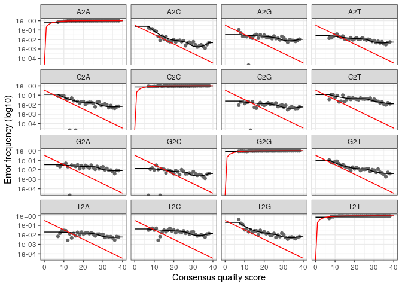

R Notebook
================

On télécharge le référentiel de cours dans un premier temps:

``` bash
wget https://github.com/ANF-MetaBioDiv/course-material/archive/refs/heads/main.zip
unzip main.zip
```

``` r
# On enregistre le chemin d'accès au dossier:
refdb_folder <- here::here("data", "refdb")
refdb_folder
```

    ## [1] "/home/rstudio/ADM2023_tutoriel/data/refdb"

here::here() veut dire “dans le package here, cherche la fonction here”

``` r
# On créé le nouveau dossier (seulement s'il n'existe pas déjà, d'où la commande "if"): 
if (!dir.exists(refdb_folder)) dir.create(refdb_folder, recursive = TRUE)
```

Si refdb existe pas créer de dossier, sinon oui

``` bash
cp -R course-material-main/data/raw ./data/
```

``` r
# On définit le temps après lequel R arrête d'éxécuter les programmes: 
getOption("timeout")
# Par défaut, ce temps est de 60 secondes
# Pour le changer, il suffit d'éxécuter la commande, avec par exemple : options(timeout = 1200)
options(timeout = 1200)
# Le temps serait alors défini sur 1200 secondes, soit 20 minutes
```

``` r
# On définit une nouvelle variable qui reçoit le chemin dans fdb folder
silva_train_set <- file.path(refdb_folder,
                             "silva_nr99_v138.1_train_set.fa.gz")

silva_species_assignment <- file.path(refdb_folder,
                                      "silva_species_assignment_v138.1.fa.gz")
```

``` r
# De la même manière, on télécharge les dossiers s'ils n'existent pas déjà:
if (!file.exists(silva_train_set)) {
  download.file(
    "https://zenodo.org/record/4587955/files/silva_nr99_v138.1_train_set.fa.gz",
    silva_train_set,
    quiet = TRUE
  )
}

if (!file.exists(silva_species_assignment)) {
  download.file(
    "https://zenodo.org/record/4587955/files/silva_species_assignment_v138.1.fa.gz",
    silva_species_assignment,
    quiet = TRUE
  )
}
```

Zenodo est un dépôt de fichier

``` r
# On enregistre le chemin d'accès au répertoire dans une variable, qui contient les données fastq (donc les données brutes issues du séquençage):
path_to_fastqs <- here::here("data", "raw")
```

``` r
fnFs <- sort(list.files(path_to_fastqs,
                        pattern = "_R1.fastq.gz",
                        full.names = TRUE))
print(fnFs)
```

    ##  [1] "/home/rstudio/ADM2023_tutoriel/data/raw/S11B_R1.fastq.gz"
    ##  [2] "/home/rstudio/ADM2023_tutoriel/data/raw/S1B_R1.fastq.gz" 
    ##  [3] "/home/rstudio/ADM2023_tutoriel/data/raw/S2B_R1.fastq.gz" 
    ##  [4] "/home/rstudio/ADM2023_tutoriel/data/raw/S2S_R1.fastq.gz" 
    ##  [5] "/home/rstudio/ADM2023_tutoriel/data/raw/S3B_R1.fastq.gz" 
    ##  [6] "/home/rstudio/ADM2023_tutoriel/data/raw/S3S_R1.fastq.gz" 
    ##  [7] "/home/rstudio/ADM2023_tutoriel/data/raw/S4B_R1.fastq.gz" 
    ##  [8] "/home/rstudio/ADM2023_tutoriel/data/raw/S4S_R1.fastq.gz" 
    ##  [9] "/home/rstudio/ADM2023_tutoriel/data/raw/S5B_R1.fastq.gz" 
    ## [10] "/home/rstudio/ADM2023_tutoriel/data/raw/S5S_R1.fastq.gz" 
    ## [11] "/home/rstudio/ADM2023_tutoriel/data/raw/S6B_R1.fastq.gz" 
    ## [12] "/home/rstudio/ADM2023_tutoriel/data/raw/S6S_R1.fastq.gz" 
    ## [13] "/home/rstudio/ADM2023_tutoriel/data/raw/S7B_R1.fastq.gz" 
    ## [14] "/home/rstudio/ADM2023_tutoriel/data/raw/S7S_R1.fastq.gz" 
    ## [15] "/home/rstudio/ADM2023_tutoriel/data/raw/S8B_R1.fastq.gz" 
    ## [16] "/home/rstudio/ADM2023_tutoriel/data/raw/S8S_R1.fastq.gz" 
    ## [17] "/home/rstudio/ADM2023_tutoriel/data/raw/S9B_R1.fastq.gz" 
    ## [18] "/home/rstudio/ADM2023_tutoriel/data/raw/S9S_R1.fastq.gz"

``` r
# list.files permet de lister les fichiers présents
# "pattern" permet de sélectionner les noms de fichiers se terminant par une expression (ici on a sélectionné les noms de fichiers se terminant par _R1.fastq.gz)

fnRs <- sort(list.files(path_to_fastqs,
                        pattern = "_R2.fastq.gz",
                        full.names = TRUE))
print(fnRs)
```

    ##  [1] "/home/rstudio/ADM2023_tutoriel/data/raw/S11B_R2.fastq.gz"
    ##  [2] "/home/rstudio/ADM2023_tutoriel/data/raw/S1B_R2.fastq.gz" 
    ##  [3] "/home/rstudio/ADM2023_tutoriel/data/raw/S2B_R2.fastq.gz" 
    ##  [4] "/home/rstudio/ADM2023_tutoriel/data/raw/S2S_R2.fastq.gz" 
    ##  [5] "/home/rstudio/ADM2023_tutoriel/data/raw/S3B_R2.fastq.gz" 
    ##  [6] "/home/rstudio/ADM2023_tutoriel/data/raw/S3S_R2.fastq.gz" 
    ##  [7] "/home/rstudio/ADM2023_tutoriel/data/raw/S4B_R2.fastq.gz" 
    ##  [8] "/home/rstudio/ADM2023_tutoriel/data/raw/S4S_R2.fastq.gz" 
    ##  [9] "/home/rstudio/ADM2023_tutoriel/data/raw/S5B_R2.fastq.gz" 
    ## [10] "/home/rstudio/ADM2023_tutoriel/data/raw/S5S_R2.fastq.gz" 
    ## [11] "/home/rstudio/ADM2023_tutoriel/data/raw/S6B_R2.fastq.gz" 
    ## [12] "/home/rstudio/ADM2023_tutoriel/data/raw/S6S_R2.fastq.gz" 
    ## [13] "/home/rstudio/ADM2023_tutoriel/data/raw/S7B_R2.fastq.gz" 
    ## [14] "/home/rstudio/ADM2023_tutoriel/data/raw/S7S_R2.fastq.gz" 
    ## [15] "/home/rstudio/ADM2023_tutoriel/data/raw/S8B_R2.fastq.gz" 
    ## [16] "/home/rstudio/ADM2023_tutoriel/data/raw/S8S_R2.fastq.gz" 
    ## [17] "/home/rstudio/ADM2023_tutoriel/data/raw/S9B_R2.fastq.gz" 
    ## [18] "/home/rstudio/ADM2023_tutoriel/data/raw/S9S_R2.fastq.gz"

``` r
# Ici on a sélectionné les noms de fichiers se terminant par _R2.fastq.gz
```

fnFs = liste des fichiers qu’il y a dans la variable et qui contient le
patterne f1.fastq (liste des chemins qui mènent aux fichiers)

``` r
sample_names <- basename(fnFs) |>
  strsplit(split = "_") |>
  sapply(head, 1)
print(sample_names)
```

    ##  [1] "S11B" "S1B"  "S2B"  "S2S"  "S3B"  "S3S"  "S4B"  "S4S"  "S5B"  "S5S" 
    ## [11] "S6B"  "S6S"  "S7B"  "S7S"  "S8B"  "S8S"  "S9B"  "S9S"

``` r
# basename() permet de ne conserver que le nom du fichier, en supprimant le chemin d'accès
# l> permet d'enchaîner des fonctions, en évitant les variables intermédiaires et les parenthèses imbriquées
# strsplit() permet de diviser une chaine de caractères selon le modèle utilisé (ici "_")
# sapply() permet d'appliquer une fonction à chaque élément de la liste ou du vecteur
```

Sample_names reçoit le nom de base pour chaque fnFs (basename = nom du
fichier sans toute l’arborescence)

Strsplit = fonction de déoupage de caractère, avec comme séparateur le
trait du bas (\_) Donne une liste avec 2 composants dans cette liste :
1er élément = S11B 2ème élément = R1.fastq

sapply = s’apllique dans chacun des éléments de la liste, head1 veut
dire qu’on prend juste le 1er élément (S11B, S1B…)

``` r
basename(fnFs) |>
  head()
```

    ## [1] "S11B_R1.fastq.gz" "S1B_R1.fastq.gz"  "S2B_R1.fastq.gz"  "S2S_R1.fastq.gz" 
    ## [5] "S3B_R1.fastq.gz"  "S3S_R1.fastq.gz"

``` r
# On obtient des noms de fichiers comme par exemple "S11B_R1.fastq.gz"
```

``` r
# On utilise donc la fonction strsplit() pour diviser le nom de fichier en un vecteur à 2 éléments, en divisant au niveau du "_":
basename(fnFs) |>
  strsplit(split = "_") |>
  head()
```

    ## [[1]]
    ## [1] "S11B"        "R1.fastq.gz"
    ## 
    ## [[2]]
    ## [1] "S1B"         "R1.fastq.gz"
    ## 
    ## [[3]]
    ## [1] "S2B"         "R1.fastq.gz"
    ## 
    ## [[4]]
    ## [1] "S2S"         "R1.fastq.gz"
    ## 
    ## [[5]]
    ## [1] "S3B"         "R1.fastq.gz"
    ## 
    ## [[6]]
    ## [1] "S3S"         "R1.fastq.gz"

``` r
# On obtient bien d'un côté "S11B" et de l'autre "R1.fastq.gz", le "_" ayant disparu
```

``` r
# Pour cela, on utilise la fonction sapply() qui va nous permettre de garder que le premier élément, par exemple "S11B"
basename(fnFs) |>
  strsplit(split = "_") |>
  sapply(head, 1) |>
  head()
```

    ## [1] "S11B" "S1B"  "S2B"  "S2S"  "S3B"  "S3S"

``` r
# On peut obtenir le même résultat, en utilisant des expressions régulières:
gsub("^.+/|_.+$", "", fnFs) |> head()
```

    ## [1] "S11B" "S1B"  "S2B"  "S2S"  "S3B"  "S3S"

``` r
# On télécharge toutes les fonctions se trouvant dans R, en utilisant le chemin:
devtools::load_all(path ="/home/rstudio/ADM2023_tutoriel/course-material-main/R")
```

    ## ℹ Loading ANF_metaB

``` r
# On créé un répertoire pour les résultats (="outputs"):
quality_folder <- here::here("outputs",
                             "dada2",
                             "quality_plots")

if (!dir.exists(quality_folder)) {
  dir.create(quality_folder, recursive = TRUE)
}

# On utilise la fonction qualityprofile() pour vérifier la qualité des séquences brutes:
qualityprofile(fnFs,
               fnRs,
               file.path(quality_folder, "quality_plots.pdf"))
```

    ## png 
    ##   2

``` r
# Ceci génère un fichier au format PDF, comportant l'ensemble des plots, c'est-à-dire des graphiques représentant la qualité des séquences brutes
```

``` r
# On créé un dossier pour enregistrer les lectures une fois qu'elles sont coupées (trimmed reads): 
path_to_trimmed_reads <- here::here(
  "outputs",
  "dada2",
  "trimmed"
)

if (!dir.exists(path_to_trimmed_reads)) dir.create(path_to_trimmed_reads, recursive = TRUE)
```

Dans mon camp de base, mets moi un dossier “outputs”, dedans mets moi un
dossier “dada2”, dans dada2 mets moi un dossier “trimmed”

``` r
# On enregistre les amorces primer (fwd) et inverse (rev) respectivement dans des variables :
primer_fwd  <- "CCTACGGGNBGCASCAG"
primer_rev  <- "GACTACNVGGGTATCTAAT"
print(primer_fwd)
```

    ## [1] "CCTACGGGNBGCASCAG"

``` r
print(primer_rev)
```

    ## [1] "GACTACNVGGGTATCTAAT"

``` r
# On regarde les séquences des R1:
Biostrings::readDNAStringSet(
  fnFs[1],
  format = "fastq",
  nrec = 10
)
```

    ## DNAStringSet object of length 10:
    ##      width seq                                              names               
    ##  [1]   293 CCTACGGGGGGCAGCAGTAGGGA...ACATCGGCTTAACCGATGAAGT M01522:260:000000...
    ##  [2]   293 CCTACGGGTGGCACCAGTAGGGA...CGGGGCTTAACCTCGGAACTGC M01522:260:000000...
    ##  [3]   292 CCTACGGGGCGCAGCAGGCGCGA...GGGACCGGGAGAGGTGTGAGGT M01522:260:000000...
    ##  [4]   293 CCTACGGGGTGCAGCAGTAGGGA...TCAAAACTCCCAGTCTAGAGTT M01522:260:000000...
    ##  [5]   291 CCTACGGGTGGCAGCAGTGGGGA...GCAGTGGAAACTGTTGGGCTTG M01522:260:000000...
    ##  [6]   293 CCTACGGGATGCAGCAGGCGCGA...GGGACCGGGAGAGGTGTGGGGG M01522:260:000000...
    ##  [7]   292 CCTACGGGATGCAGCAGTGGGGA...TTTAATCCTGATGAGCTAGAAA M01522:260:000000...
    ##  [8]   293 CCTACGGGGCGCAGCAGTAGGGA...TTAAAACTTTTGTTCTGGAATT M01522:260:000000...
    ##  [9]   292 CCTACGGGTTGCAGCAGTGGGGA...ATTAAAACTTTTCAGCTAGAGT M01522:260:000000...
    ## [10]   293 CCTACGGGAGGCAGCAGTGGGGA...CCCGGGCTCAACCTGGGAACGG M01522:260:000000...

``` r
# Même chose pour les R2:
Biostrings::readDNAStringSet(
  fnRs[1],
  format = "fastq",
  nrec = 10
)
```

    ## DNAStringSet object of length 10:
    ##      width seq                                              names               
    ##  [1]   301 GACTACCAGGGTATCTAATCCTG...GGCTGCTGGCACGAAGTTCGCC M01522:260:000000...
    ##  [2]   301 GACTACCGGGGTATCTAATCCTG...GGCTGCTGGCACGGAGTTAGCC M01522:260:000000...
    ##  [3]   300 AATCCGGTTCGTGCCCCTAGGCT...TCTTTCCCAGCCCTTATTCCAA M01522:260:000000...
    ##  [4]   301 GACTACCGGGGTATCTAATCCTG...GGCTGCTGGCACGGAGTTAGCC M01522:260:000000...
    ##  [5]   301 GACTACCGGGGTATCTAATCCCT...GGCTGCTGGCCCGGAATTAGCC M01522:260:000000...
    ##  [6]   301 GGTATCTAATCCGGTTCGTGCCC...CACCGTCCTTACCCCCCCCTTT M01522:260:000000...
    ##  [7]   301 GGTATCTAATCTTGTTTGCTCCC...CCCGACGTTAGCCGGGGCTTCT M01522:260:000000...
    ##  [8]   301 GACTACGAGGGTATCTAATCCCG...GGCTGCTGGCACGGAATTAGCC M01522:260:000000...
    ##  [9]   301 GGTATCTAATCCTCTTCGCTACC...CACGAAGTTAGCCGGACCTTCT M01522:260:000000...
    ## [10]   301 GACTACGGGGGTATCTAATCCTG...GGCTGCCGGCACGGGGTTAGCC M01522:260:000000...

Ne montre que les 10 premières séquences ADN du fichier forward du 1er
échantillon fnRs\[1\] = montre le 1er élément de fnRS On voit que les 10
premières lignes commencent toutes par la même séquence

``` bash
pwd
cp -R /home/rstudio/ADM2023_tutoriel/course-material-main/bash .
```

``` r
# On utilise alors la fonction primer_trim() pour supprimer les amorces:
(primer_log <- primer_trim(
  forward_files = fnFs,
  reverse_files = fnRs,
  primer_fwd = primer_fwd,
  primer_rev = primer_rev,
  output_dir = path_to_trimmed_reads,
  min_size = 200
))
```

    ##    sample status in_reads   in_bp too_short too_long too_many_n out_reads
    ## 1    S11B     OK     2000 1186767         0        0          0      1863
    ## 2     S1B     OK     2000 1186613         1        0          0      1855
    ## 3     S2B     OK     2000 1186942         0        0          0      1839
    ## 4     S2S     OK     2000 1186868         0        0          0      1833
    ## 5     S3B     OK     2000 1186650         0        0          0      1860
    ## 6     S3S     OK     2000 1186475         1        0          0      1880
    ## 7     S4B     OK     2000 1186331         2        0          0      1867
    ## 8     S4S     OK     2000 1186681         0        0          0      1872
    ## 9     S5B     OK     2000 1186386         1        0          0      1841
    ## 10    S5S     OK     2000 1186501         1        0          0      1861
    ## 11    S6B     OK     2000 1186261         2        0          0      1839
    ## 12    S6S     OK     2000 1187078         1        0          0      1835
    ## 13    S7B     OK     2000 1186888         0        0          0      1825
    ## 14    S7S     OK     2000 1186299         3        0          0      1845
    ## 15    S8B     OK     2000 1186354         3        0          0      1840
    ## 16    S8S     OK     2000 1186610         1        0          0      1848
    ## 17    S9B     OK     2000 1187038         0        0          0      1834
    ## 18    S9S     OK     2000 1186867         0        0          0      1835
    ##    w/adapters qualtrim_bp out_bp w/adapters2 qualtrim2_bp out2_bp
    ## 1        1986           0 513149        1876            0  528595
    ## 2        1975           0 511096        1877            0  525893
    ## 3        1987           0 506659        1850            0  521371
    ## 4        1989           0 504998        1843            0  519979
    ## 5        1989           0 512326        1870            0  527518
    ## 6        1989           0 517598        1891            0  532758
    ## 7        1980           0 514342        1884            0  529379
    ## 8        1987           0 515511        1884            0  530555
    ## 9        1984           0 506972        1856            0  522013
    ## 10       1991           0 512539        1869            0  527592
    ## 11       1981           0 506577        1857            0  521787
    ## 12       1982           0 505929        1851            0  520562
    ## 13       1987           0 503033        1836            0  517931
    ## 14       1987           0 508524        1857            0  523039
    ## 15       1993           0 507178        1847            0  522137
    ## 16       1982           0 509177        1865            0  524085
    ## 17       1983           0 505424        1851            0  520706
    ## 18       1979           0 505519        1853            0  520103

On utilise la fonction primer_trim qui fait appel au logiciel cutadapt,
on donne les fnFs et fnRs, il faut que les séquences fassent minimum 200
nucléotides Une fois les adpatauets et ammorces Illumina enlevés,
quelques séquences ont été enlevées

``` r
nopFw <- sort(list.files(path_to_trimmed_reads, pattern = "R1", full.names = TRUE))
nopRv <- sort(list.files(path_to_trimmed_reads, pattern = "R2", full.names = TRUE))
print(nopFw)
```

    ##  [1] "/home/rstudio/ADM2023_tutoriel/outputs/dada2/trimmed/S11B_R1.fastq.gz"
    ##  [2] "/home/rstudio/ADM2023_tutoriel/outputs/dada2/trimmed/S1B_R1.fastq.gz" 
    ##  [3] "/home/rstudio/ADM2023_tutoriel/outputs/dada2/trimmed/S2B_R1.fastq.gz" 
    ##  [4] "/home/rstudio/ADM2023_tutoriel/outputs/dada2/trimmed/S2S_R1.fastq.gz" 
    ##  [5] "/home/rstudio/ADM2023_tutoriel/outputs/dada2/trimmed/S3B_R1.fastq.gz" 
    ##  [6] "/home/rstudio/ADM2023_tutoriel/outputs/dada2/trimmed/S3S_R1.fastq.gz" 
    ##  [7] "/home/rstudio/ADM2023_tutoriel/outputs/dada2/trimmed/S4B_R1.fastq.gz" 
    ##  [8] "/home/rstudio/ADM2023_tutoriel/outputs/dada2/trimmed/S4S_R1.fastq.gz" 
    ##  [9] "/home/rstudio/ADM2023_tutoriel/outputs/dada2/trimmed/S5B_R1.fastq.gz" 
    ## [10] "/home/rstudio/ADM2023_tutoriel/outputs/dada2/trimmed/S5S_R1.fastq.gz" 
    ## [11] "/home/rstudio/ADM2023_tutoriel/outputs/dada2/trimmed/S6B_R1.fastq.gz" 
    ## [12] "/home/rstudio/ADM2023_tutoriel/outputs/dada2/trimmed/S6S_R1.fastq.gz" 
    ## [13] "/home/rstudio/ADM2023_tutoriel/outputs/dada2/trimmed/S7B_R1.fastq.gz" 
    ## [14] "/home/rstudio/ADM2023_tutoriel/outputs/dada2/trimmed/S7S_R1.fastq.gz" 
    ## [15] "/home/rstudio/ADM2023_tutoriel/outputs/dada2/trimmed/S8B_R1.fastq.gz" 
    ## [16] "/home/rstudio/ADM2023_tutoriel/outputs/dada2/trimmed/S8S_R1.fastq.gz" 
    ## [17] "/home/rstudio/ADM2023_tutoriel/outputs/dada2/trimmed/S9B_R1.fastq.gz" 
    ## [18] "/home/rstudio/ADM2023_tutoriel/outputs/dada2/trimmed/S9S_R1.fastq.gz"

``` r
print(nopRv)
```

    ##  [1] "/home/rstudio/ADM2023_tutoriel/outputs/dada2/trimmed/S11B_R2.fastq.gz"
    ##  [2] "/home/rstudio/ADM2023_tutoriel/outputs/dada2/trimmed/S1B_R2.fastq.gz" 
    ##  [3] "/home/rstudio/ADM2023_tutoriel/outputs/dada2/trimmed/S2B_R2.fastq.gz" 
    ##  [4] "/home/rstudio/ADM2023_tutoriel/outputs/dada2/trimmed/S2S_R2.fastq.gz" 
    ##  [5] "/home/rstudio/ADM2023_tutoriel/outputs/dada2/trimmed/S3B_R2.fastq.gz" 
    ##  [6] "/home/rstudio/ADM2023_tutoriel/outputs/dada2/trimmed/S3S_R2.fastq.gz" 
    ##  [7] "/home/rstudio/ADM2023_tutoriel/outputs/dada2/trimmed/S4B_R2.fastq.gz" 
    ##  [8] "/home/rstudio/ADM2023_tutoriel/outputs/dada2/trimmed/S4S_R2.fastq.gz" 
    ##  [9] "/home/rstudio/ADM2023_tutoriel/outputs/dada2/trimmed/S5B_R2.fastq.gz" 
    ## [10] "/home/rstudio/ADM2023_tutoriel/outputs/dada2/trimmed/S5S_R2.fastq.gz" 
    ## [11] "/home/rstudio/ADM2023_tutoriel/outputs/dada2/trimmed/S6B_R2.fastq.gz" 
    ## [12] "/home/rstudio/ADM2023_tutoriel/outputs/dada2/trimmed/S6S_R2.fastq.gz" 
    ## [13] "/home/rstudio/ADM2023_tutoriel/outputs/dada2/trimmed/S7B_R2.fastq.gz" 
    ## [14] "/home/rstudio/ADM2023_tutoriel/outputs/dada2/trimmed/S7S_R2.fastq.gz" 
    ## [15] "/home/rstudio/ADM2023_tutoriel/outputs/dada2/trimmed/S8B_R2.fastq.gz" 
    ## [16] "/home/rstudio/ADM2023_tutoriel/outputs/dada2/trimmed/S8S_R2.fastq.gz" 
    ## [17] "/home/rstudio/ADM2023_tutoriel/outputs/dada2/trimmed/S9B_R2.fastq.gz" 
    ## [18] "/home/rstudio/ADM2023_tutoriel/outputs/dada2/trimmed/S9S_R2.fastq.gz"

Met le nom des fichiers une fois que les reads ont été trimés

``` r
# De nouveau, on créé un dossier, s'il n'existe pas déjà:
path_to_filtered_reads <- here::here("outputs", "dada2", "filtered")
if (!dir.exists(path_to_filtered_reads)) dir.create(path_to_filtered_reads, recursive = TRUE)
```

``` r
# On fait de même pour lister les chemins:
filtFs <- file.path(path_to_filtered_reads, basename(fnFs))
filtRs <- file.path(path_to_filtered_reads, basename(fnRs))
print(filtFs)
```

    ##  [1] "/home/rstudio/ADM2023_tutoriel/outputs/dada2/filtered/S11B_R1.fastq.gz"
    ##  [2] "/home/rstudio/ADM2023_tutoriel/outputs/dada2/filtered/S1B_R1.fastq.gz" 
    ##  [3] "/home/rstudio/ADM2023_tutoriel/outputs/dada2/filtered/S2B_R1.fastq.gz" 
    ##  [4] "/home/rstudio/ADM2023_tutoriel/outputs/dada2/filtered/S2S_R1.fastq.gz" 
    ##  [5] "/home/rstudio/ADM2023_tutoriel/outputs/dada2/filtered/S3B_R1.fastq.gz" 
    ##  [6] "/home/rstudio/ADM2023_tutoriel/outputs/dada2/filtered/S3S_R1.fastq.gz" 
    ##  [7] "/home/rstudio/ADM2023_tutoriel/outputs/dada2/filtered/S4B_R1.fastq.gz" 
    ##  [8] "/home/rstudio/ADM2023_tutoriel/outputs/dada2/filtered/S4S_R1.fastq.gz" 
    ##  [9] "/home/rstudio/ADM2023_tutoriel/outputs/dada2/filtered/S5B_R1.fastq.gz" 
    ## [10] "/home/rstudio/ADM2023_tutoriel/outputs/dada2/filtered/S5S_R1.fastq.gz" 
    ## [11] "/home/rstudio/ADM2023_tutoriel/outputs/dada2/filtered/S6B_R1.fastq.gz" 
    ## [12] "/home/rstudio/ADM2023_tutoriel/outputs/dada2/filtered/S6S_R1.fastq.gz" 
    ## [13] "/home/rstudio/ADM2023_tutoriel/outputs/dada2/filtered/S7B_R1.fastq.gz" 
    ## [14] "/home/rstudio/ADM2023_tutoriel/outputs/dada2/filtered/S7S_R1.fastq.gz" 
    ## [15] "/home/rstudio/ADM2023_tutoriel/outputs/dada2/filtered/S8B_R1.fastq.gz" 
    ## [16] "/home/rstudio/ADM2023_tutoriel/outputs/dada2/filtered/S8S_R1.fastq.gz" 
    ## [17] "/home/rstudio/ADM2023_tutoriel/outputs/dada2/filtered/S9B_R1.fastq.gz" 
    ## [18] "/home/rstudio/ADM2023_tutoriel/outputs/dada2/filtered/S9S_R1.fastq.gz"

``` r
print(filtRs)
```

    ##  [1] "/home/rstudio/ADM2023_tutoriel/outputs/dada2/filtered/S11B_R2.fastq.gz"
    ##  [2] "/home/rstudio/ADM2023_tutoriel/outputs/dada2/filtered/S1B_R2.fastq.gz" 
    ##  [3] "/home/rstudio/ADM2023_tutoriel/outputs/dada2/filtered/S2B_R2.fastq.gz" 
    ##  [4] "/home/rstudio/ADM2023_tutoriel/outputs/dada2/filtered/S2S_R2.fastq.gz" 
    ##  [5] "/home/rstudio/ADM2023_tutoriel/outputs/dada2/filtered/S3B_R2.fastq.gz" 
    ##  [6] "/home/rstudio/ADM2023_tutoriel/outputs/dada2/filtered/S3S_R2.fastq.gz" 
    ##  [7] "/home/rstudio/ADM2023_tutoriel/outputs/dada2/filtered/S4B_R2.fastq.gz" 
    ##  [8] "/home/rstudio/ADM2023_tutoriel/outputs/dada2/filtered/S4S_R2.fastq.gz" 
    ##  [9] "/home/rstudio/ADM2023_tutoriel/outputs/dada2/filtered/S5B_R2.fastq.gz" 
    ## [10] "/home/rstudio/ADM2023_tutoriel/outputs/dada2/filtered/S5S_R2.fastq.gz" 
    ## [11] "/home/rstudio/ADM2023_tutoriel/outputs/dada2/filtered/S6B_R2.fastq.gz" 
    ## [12] "/home/rstudio/ADM2023_tutoriel/outputs/dada2/filtered/S6S_R2.fastq.gz" 
    ## [13] "/home/rstudio/ADM2023_tutoriel/outputs/dada2/filtered/S7B_R2.fastq.gz" 
    ## [14] "/home/rstudio/ADM2023_tutoriel/outputs/dada2/filtered/S7S_R2.fastq.gz" 
    ## [15] "/home/rstudio/ADM2023_tutoriel/outputs/dada2/filtered/S8B_R2.fastq.gz" 
    ## [16] "/home/rstudio/ADM2023_tutoriel/outputs/dada2/filtered/S8S_R2.fastq.gz" 
    ## [17] "/home/rstudio/ADM2023_tutoriel/outputs/dada2/filtered/S9B_R2.fastq.gz" 
    ## [18] "/home/rstudio/ADM2023_tutoriel/outputs/dada2/filtered/S9S_R2.fastq.gz"

``` r
# On établit ensuite un lien entre les fichiers et les noms d'échantillons:
names(filtFs) <- sample_names
names(filtRs) <- sample_names
```

``` r
# On utilise la fonction filterAndTrim() pour pouvoir filtrer et découper un fichier d'entrée fastq, sur la base de plusieurs critères définissables (fwd, filt, maxN...), et ce afin de produire un nouveau fichier fastq contenant les lectures découpées ayant passé le ou les filtres: 
(out <- dada2::filterAndTrim(
  fwd = nopFw,
  filt = filtFs,
  rev = nopRv,
  filt.rev = filtRs,
  minLen = 150,
  matchIDs = TRUE,
  maxN = 0,
  maxEE = c(3, 3),
  truncQ = 2
))
```

    ##                  reads.in reads.out
    ## S11B_R1.fastq.gz     1863      1200
    ## S1B_R1.fastq.gz      1855      1251
    ## S2B_R1.fastq.gz      1839      1255
    ## S2S_R1.fastq.gz      1833      1244
    ## S3B_R1.fastq.gz      1860      1244
    ## S3S_R1.fastq.gz      1880      1312
    ## S4B_R1.fastq.gz      1867      1262
    ## S4S_R1.fastq.gz      1872      1328
    ## S5B_R1.fastq.gz      1841      1255
    ## S5S_R1.fastq.gz      1861      1244
    ## S6B_R1.fastq.gz      1839      1251
    ## S6S_R1.fastq.gz      1835      1239
    ## S7B_R1.fastq.gz      1825      1203
    ## S7S_R1.fastq.gz      1845      1182
    ## S8B_R1.fastq.gz      1840      1169
    ## S8S_R1.fastq.gz      1848      1267
    ## S9B_R1.fastq.gz      1834      1195
    ## S9S_R1.fastq.gz      1835      1249

``` r
# fwd prend le chemin d'accès au fichier fastq, ou le répertoire le contenant
# filt prend le chemin conduisant vers le fichier de sortie fastq filtré (correspondant au filtrage du fichier d'entrée fastq fwd)
# rev prend le chemin vers le fichier fastq inversé, à partir des données de séquences paires correspondant à celle fournit pour fwd
# filt.rev prend le chemin vers le fichier de sortie filtré fastq (correspondant au fichier d'entrée rev)
# minLen supprime les lectures dont la longueur est inférieure à minLen (ici 150)
# matchIDs filtre uniquement par paires (permet de faire correspondre les fichiers avant et après filtrage). Si TRUE, seules les lectures possédant des similarités sont produites. Si FALSE, pas de vérification
# maxN élimine les séquences contenant des N (dada2 n'autorise pas les N, donc on met maxN = 0), donc cela correspond au nombre de bases ambigües acceptées
# maxEE permet d'éliminer les lectures dont le nombres "d'érreurs attendues" est supérieur à maxEE
# truncQ permet de tronquer les lectures à la première occurence d'un score de qualité inférieur ou égal à truncQ
```

R1 et R2 doivent avoir la même identité (matchIDs) maxN=0 veut dire
qu’il doit y avoir 0 ambiguité (N veut dire qu’on sait pas si c’est un
A,T,C ou G) Read de mauvaise qualité quand il y a des N truncQ veut dire
que c’est la moyenne d’un score de qualité sur une fenêtre de 20

``` r
# Il faut utiliser un modèle d'erreur, pour savoir à quelle vitesse un nucléotide est remplacé par un autre pour un score de qualité donné. Pour cela, on utilise la fonction learnErrors():
errF <- dada2::learnErrors(filtFs,
                           randomize = TRUE,
                           multithread = TRUE)
```

    ## 6157072 total bases in 22350 reads from 18 samples will be used for learning the error rates.

``` r
errR <- dada2::learnErrors(filtRs,
                           randomize = TRUE,
                           multithread = TRUE)
```

    ## 6337638 total bases in 22350 reads from 18 samples will be used for learning the error rates.

``` r
# On souhaite modéliser graphiquement le modèle d'erreur:
dada2::plotErrors(errF, nominalQ=TRUE)
```

    ## Warning: Transformation introduced infinite values in continuous y-axis
    ## Transformation introduced infinite values in continuous y-axis

<!-- -->

``` r
# Pour chaque séquence unique, on souhaite compter le nombre de lectures. Cette déréplication est permise grâce à la fonction dada2::derepFastq():
derepFs <- dada2::derepFastq(filtFs, verbose = TRUE)
```

    ## Dereplicating sequence entries in Fastq file: /home/rstudio/ADM2023_tutoriel/outputs/dada2/filtered/S11B_R1.fastq.gz

    ## Encountered 754 unique sequences from 1200 total sequences read.

    ## Dereplicating sequence entries in Fastq file: /home/rstudio/ADM2023_tutoriel/outputs/dada2/filtered/S1B_R1.fastq.gz

    ## Encountered 779 unique sequences from 1251 total sequences read.

    ## Dereplicating sequence entries in Fastq file: /home/rstudio/ADM2023_tutoriel/outputs/dada2/filtered/S2B_R1.fastq.gz

    ## Encountered 789 unique sequences from 1255 total sequences read.

    ## Dereplicating sequence entries in Fastq file: /home/rstudio/ADM2023_tutoriel/outputs/dada2/filtered/S2S_R1.fastq.gz

    ## Encountered 762 unique sequences from 1244 total sequences read.

    ## Dereplicating sequence entries in Fastq file: /home/rstudio/ADM2023_tutoriel/outputs/dada2/filtered/S3B_R1.fastq.gz

    ## Encountered 772 unique sequences from 1244 total sequences read.

    ## Dereplicating sequence entries in Fastq file: /home/rstudio/ADM2023_tutoriel/outputs/dada2/filtered/S3S_R1.fastq.gz

    ## Encountered 763 unique sequences from 1312 total sequences read.

    ## Dereplicating sequence entries in Fastq file: /home/rstudio/ADM2023_tutoriel/outputs/dada2/filtered/S4B_R1.fastq.gz

    ## Encountered 738 unique sequences from 1262 total sequences read.

    ## Dereplicating sequence entries in Fastq file: /home/rstudio/ADM2023_tutoriel/outputs/dada2/filtered/S4S_R1.fastq.gz

    ## Encountered 638 unique sequences from 1328 total sequences read.

    ## Dereplicating sequence entries in Fastq file: /home/rstudio/ADM2023_tutoriel/outputs/dada2/filtered/S5B_R1.fastq.gz

    ## Encountered 782 unique sequences from 1255 total sequences read.

    ## Dereplicating sequence entries in Fastq file: /home/rstudio/ADM2023_tutoriel/outputs/dada2/filtered/S5S_R1.fastq.gz

    ## Encountered 663 unique sequences from 1244 total sequences read.

    ## Dereplicating sequence entries in Fastq file: /home/rstudio/ADM2023_tutoriel/outputs/dada2/filtered/S6B_R1.fastq.gz

    ## Encountered 696 unique sequences from 1251 total sequences read.

    ## Dereplicating sequence entries in Fastq file: /home/rstudio/ADM2023_tutoriel/outputs/dada2/filtered/S6S_R1.fastq.gz

    ## Encountered 657 unique sequences from 1239 total sequences read.

    ## Dereplicating sequence entries in Fastq file: /home/rstudio/ADM2023_tutoriel/outputs/dada2/filtered/S7B_R1.fastq.gz

    ## Encountered 691 unique sequences from 1203 total sequences read.

    ## Dereplicating sequence entries in Fastq file: /home/rstudio/ADM2023_tutoriel/outputs/dada2/filtered/S7S_R1.fastq.gz

    ## Encountered 675 unique sequences from 1182 total sequences read.

    ## Dereplicating sequence entries in Fastq file: /home/rstudio/ADM2023_tutoriel/outputs/dada2/filtered/S8B_R1.fastq.gz

    ## Encountered 697 unique sequences from 1169 total sequences read.

    ## Dereplicating sequence entries in Fastq file: /home/rstudio/ADM2023_tutoriel/outputs/dada2/filtered/S8S_R1.fastq.gz

    ## Encountered 714 unique sequences from 1267 total sequences read.

    ## Dereplicating sequence entries in Fastq file: /home/rstudio/ADM2023_tutoriel/outputs/dada2/filtered/S9B_R1.fastq.gz

    ## Encountered 685 unique sequences from 1195 total sequences read.

    ## Dereplicating sequence entries in Fastq file: /home/rstudio/ADM2023_tutoriel/outputs/dada2/filtered/S9S_R1.fastq.gz

    ## Encountered 677 unique sequences from 1249 total sequences read.

``` r
derepRs <- dada2::derepFastq(filtRs, verbose = TRUE)
```

    ## Dereplicating sequence entries in Fastq file: /home/rstudio/ADM2023_tutoriel/outputs/dada2/filtered/S11B_R2.fastq.gz

    ## Encountered 928 unique sequences from 1200 total sequences read.

    ## Dereplicating sequence entries in Fastq file: /home/rstudio/ADM2023_tutoriel/outputs/dada2/filtered/S1B_R2.fastq.gz

    ## Encountered 948 unique sequences from 1251 total sequences read.

    ## Dereplicating sequence entries in Fastq file: /home/rstudio/ADM2023_tutoriel/outputs/dada2/filtered/S2B_R2.fastq.gz

    ## Encountered 968 unique sequences from 1255 total sequences read.

    ## Dereplicating sequence entries in Fastq file: /home/rstudio/ADM2023_tutoriel/outputs/dada2/filtered/S2S_R2.fastq.gz

    ## Encountered 925 unique sequences from 1244 total sequences read.

    ## Dereplicating sequence entries in Fastq file: /home/rstudio/ADM2023_tutoriel/outputs/dada2/filtered/S3B_R2.fastq.gz

    ## Encountered 948 unique sequences from 1244 total sequences read.

    ## Dereplicating sequence entries in Fastq file: /home/rstudio/ADM2023_tutoriel/outputs/dada2/filtered/S3S_R2.fastq.gz

    ## Encountered 967 unique sequences from 1312 total sequences read.

    ## Dereplicating sequence entries in Fastq file: /home/rstudio/ADM2023_tutoriel/outputs/dada2/filtered/S4B_R2.fastq.gz

    ## Encountered 953 unique sequences from 1262 total sequences read.

    ## Dereplicating sequence entries in Fastq file: /home/rstudio/ADM2023_tutoriel/outputs/dada2/filtered/S4S_R2.fastq.gz

    ## Encountered 904 unique sequences from 1328 total sequences read.

    ## Dereplicating sequence entries in Fastq file: /home/rstudio/ADM2023_tutoriel/outputs/dada2/filtered/S5B_R2.fastq.gz

    ## Encountered 975 unique sequences from 1255 total sequences read.

    ## Dereplicating sequence entries in Fastq file: /home/rstudio/ADM2023_tutoriel/outputs/dada2/filtered/S5S_R2.fastq.gz

    ## Encountered 887 unique sequences from 1244 total sequences read.

    ## Dereplicating sequence entries in Fastq file: /home/rstudio/ADM2023_tutoriel/outputs/dada2/filtered/S6B_R2.fastq.gz

    ## Encountered 914 unique sequences from 1251 total sequences read.

    ## Dereplicating sequence entries in Fastq file: /home/rstudio/ADM2023_tutoriel/outputs/dada2/filtered/S6S_R2.fastq.gz

    ## Encountered 846 unique sequences from 1239 total sequences read.

    ## Dereplicating sequence entries in Fastq file: /home/rstudio/ADM2023_tutoriel/outputs/dada2/filtered/S7B_R2.fastq.gz

    ## Encountered 881 unique sequences from 1203 total sequences read.

    ## Dereplicating sequence entries in Fastq file: /home/rstudio/ADM2023_tutoriel/outputs/dada2/filtered/S7S_R2.fastq.gz

    ## Encountered 874 unique sequences from 1182 total sequences read.

    ## Dereplicating sequence entries in Fastq file: /home/rstudio/ADM2023_tutoriel/outputs/dada2/filtered/S8B_R2.fastq.gz

    ## Encountered 879 unique sequences from 1169 total sequences read.

    ## Dereplicating sequence entries in Fastq file: /home/rstudio/ADM2023_tutoriel/outputs/dada2/filtered/S8S_R2.fastq.gz

    ## Encountered 967 unique sequences from 1267 total sequences read.

    ## Dereplicating sequence entries in Fastq file: /home/rstudio/ADM2023_tutoriel/outputs/dada2/filtered/S9B_R2.fastq.gz

    ## Encountered 892 unique sequences from 1195 total sequences read.

    ## Dereplicating sequence entries in Fastq file: /home/rstudio/ADM2023_tutoriel/outputs/dada2/filtered/S9S_R2.fastq.gz

    ## Encountered 911 unique sequences from 1249 total sequences read.

``` r
# Maintenant, il est possible d'éxécuter dada2, en utilisant le modèle d'erreur (errF) et les séquences dérépliquées (derepFs):
dadaFs <- dada2::dada(derepFs, err = errF, multithread = TRUE)
```

    ## Sample 1 - 1200 reads in 754 unique sequences.
    ## Sample 2 - 1251 reads in 779 unique sequences.
    ## Sample 3 - 1255 reads in 789 unique sequences.
    ## Sample 4 - 1244 reads in 762 unique sequences.
    ## Sample 5 - 1244 reads in 772 unique sequences.
    ## Sample 6 - 1312 reads in 763 unique sequences.
    ## Sample 7 - 1262 reads in 738 unique sequences.
    ## Sample 8 - 1328 reads in 638 unique sequences.
    ## Sample 9 - 1255 reads in 782 unique sequences.
    ## Sample 10 - 1244 reads in 663 unique sequences.
    ## Sample 11 - 1251 reads in 696 unique sequences.
    ## Sample 12 - 1239 reads in 657 unique sequences.
    ## Sample 13 - 1203 reads in 691 unique sequences.
    ## Sample 14 - 1182 reads in 675 unique sequences.
    ## Sample 15 - 1169 reads in 697 unique sequences.
    ## Sample 16 - 1267 reads in 714 unique sequences.
    ## Sample 17 - 1195 reads in 685 unique sequences.
    ## Sample 18 - 1249 reads in 677 unique sequences.

``` r
dadaRs <- dada2::dada(derepRs, err = errR, multithread = TRUE)
```

    ## Sample 1 - 1200 reads in 928 unique sequences.
    ## Sample 2 - 1251 reads in 948 unique sequences.
    ## Sample 3 - 1255 reads in 968 unique sequences.
    ## Sample 4 - 1244 reads in 925 unique sequences.
    ## Sample 5 - 1244 reads in 948 unique sequences.
    ## Sample 6 - 1312 reads in 967 unique sequences.
    ## Sample 7 - 1262 reads in 953 unique sequences.
    ## Sample 8 - 1328 reads in 904 unique sequences.
    ## Sample 9 - 1255 reads in 975 unique sequences.
    ## Sample 10 - 1244 reads in 887 unique sequences.
    ## Sample 11 - 1251 reads in 914 unique sequences.
    ## Sample 12 - 1239 reads in 846 unique sequences.
    ## Sample 13 - 1203 reads in 881 unique sequences.
    ## Sample 14 - 1182 reads in 874 unique sequences.
    ## Sample 15 - 1169 reads in 879 unique sequences.
    ## Sample 16 - 1267 reads in 967 unique sequences.
    ## Sample 17 - 1195 reads in 892 unique sequences.
    ## Sample 18 - 1249 reads in 911 unique sequences.

``` r
# Ensuite, les lectures peuvent être fusionnées, avec la fonction dada2::mergePairs():
mergers <- dada2::mergePairs(
  dadaF = dadaFs,
  derepF = derepFs,
  dadaR = dadaRs,
  derepR = derepRs,
  maxMismatch = 0,
  verbose = TRUE
)
```

    ## 879 paired-reads (in 28 unique pairings) successfully merged out of 970 (in 51 pairings) input.

    ## 835 paired-reads (in 33 unique pairings) successfully merged out of 943 (in 63 pairings) input.

    ## 783 paired-reads (in 30 unique pairings) successfully merged out of 944 (in 59 pairings) input.

    ## 929 paired-reads (in 32 unique pairings) successfully merged out of 1040 (in 59 pairings) input.

    ## 786 paired-reads (in 26 unique pairings) successfully merged out of 927 (in 60 pairings) input.

    ## 920 paired-reads (in 36 unique pairings) successfully merged out of 1040 (in 60 pairings) input.

    ## 808 paired-reads (in 29 unique pairings) successfully merged out of 971 (in 62 pairings) input.

    ## 1050 paired-reads (in 32 unique pairings) successfully merged out of 1130 (in 56 pairings) input.

    ## 905 paired-reads (in 24 unique pairings) successfully merged out of 1036 (in 40 pairings) input.

    ## 898 paired-reads (in 27 unique pairings) successfully merged out of 1039 (in 56 pairings) input.

    ## 970 paired-reads (in 31 unique pairings) successfully merged out of 1061 (in 51 pairings) input.

    ## 900 paired-reads (in 23 unique pairings) successfully merged out of 1062 (in 62 pairings) input.

    ## 823 paired-reads (in 31 unique pairings) successfully merged out of 988 (in 67 pairings) input.

    ## 852 paired-reads (in 30 unique pairings) successfully merged out of 968 (in 48 pairings) input.

    ## 842 paired-reads (in 26 unique pairings) successfully merged out of 944 (in 58 pairings) input.

    ## 849 paired-reads (in 31 unique pairings) successfully merged out of 1031 (in 62 pairings) input.

    ## 787 paired-reads (in 25 unique pairings) successfully merged out of 976 (in 55 pairings) input.

    ## 873 paired-reads (in 29 unique pairings) successfully merged out of 1044 (in 57 pairings) input.

mergers =\> Assemblage de R1 et R2, ils ne sont plus séparés

``` r
# On construit une table, connaissant le nombre de lectures dans chaque échantillon:
seqtab <- dada2::makeSequenceTable(mergers)
```

makeSequenceTable =\> cette séquence on la trouve tant de fois dans tel
échantillon…

``` r
# Il s'agit de supprimer les bimères (chimères à deux parents, sachant que les chimères sont des séquences d'artefacts formées par deux ou plusieurs séquences biologiques mal formées), et ce grâce à la fonction dada2::removeBimeraDenovo():
seqtab_nochim <- dada2::removeBimeraDenovo(seqtab,
                                           method = "consensus",
                                           multithread = TRUE,
                                           verbose = TRUE)
```

    ## Identified 2 bimeras out of 162 input sequences.

``` r
# La table est prête, mais il s'agit grâce à la fonction dada2:assignTaxonomy() de connaitre l'identité taxonomique en comparant les séquences à des bases de données de référence, telles que SILVA:
taxonomy <- dada2::assignTaxonomy(
  seqs = seqtab_nochim,
  refFasta = silva_train_set,
  taxLevels = c("Kingdom", "Phylum", "Class",
                "Order", "Family", "Genus",
                "Species"),
  multithread = TRUE,
  minBoot = 60
)
```

``` r
# Cette méthode ne parvient pas tout le temps à attribuer au niveau de l'espèce. On peut alors utiliser la séquence dada2::addSpecies(), si on considère qu'on appartient à la même espèce quand on a 100% de similarité à une séquence de référence
taxonomy <- dada2::addSpecies(
  taxonomy,
  silva_species_assignment,
  allowMultiple = FALSE
)
```

``` r
# Les résultats sont prêts, il s'agit de les préparer pour pouvoir les exporter:
export_folder <- here::here("outputs", "dada2", "asv_table")

if (!dir.exists(export_folder)) dir.create(export_folder, recursive = TRUE)

saveRDS(object = seqtab_nochim,
        file = file.path(export_folder, "seqtab_nochim.rds"))

saveRDS(object = taxonomy,
        file = file.path(export_folder, "taxonomy.rds"))
```

``` r
# On créé une nouvelle variable pour collecter les séquences:
asv_seq <- colnames(seqtab_nochim)
```

``` r
# Puis on les "sépare":
ndigits <- nchar(length(asv_seq))
asv_id <- sprintf(paste0("ASV_%0", ndigits, "d"), seq_along(asv_seq))
```

``` r
# On renomme les différentes variables:
row.names(taxonomy) <- colnames(seqtab_nochim) <- names(asv_seq) <- asv_id
```

``` r
# Avant de pouvoir exporter les données, on convertit les noms de lignes en une nouvelle colonne grâce à la fonction df_export():
taxonomy_export <- df_export(taxonomy, new_rn = "asv")

seqtab_nochim_export <- t(seqtab_nochim)
seqtab_nochim_export <- df_export(seqtab_nochim_export, new_rn = "asv")
```

``` r
# On exporte la taxonomie:
write.table(taxonomy_export,
            file = file.path(export_folder, "taxonomy.tsv"),
            quote = FALSE,
            sep = "\t",
            row.names = FALSE)
```

``` r
# On exporte la table:
write.table(seqtab_nochim_export,
            file = file.path(export_folder, "asv_table.tsv"),
            quote = FALSE,
            sep = "\t",
            row.names = FALSE)
```

``` r
# Enfin, on exporte les séquences fasta:
cat(paste0(">", names(asv_seq), "\n", asv_seq),
    sep = "\n",
    file = file.path(export_folder, "asv.fasta"))
```

``` r
# On peut également exporter les statistiques sur chaque étape de prétaitement, d'abord en les assemblant:
getN <- function(x) sum(dada2::getUniques(x))

log_table <- data.frame(
  input = primer_log$in_reads,
  with_fwd_primer = primer_log$`w/adapters`,
  with_rev_primer = primer_log$`w/adapters2` ,
  with_both_primers = out[, 1],
  filtered = out[, 2],
  denoisedF = sapply(dadaFs, getN),
  denoisedR = sapply(dadaRs, getN),
  merged = sapply(mergers, getN),
  nonchim = rowSums(seqtab_nochim),
  perc_retained = rowSums(seqtab_nochim) / out[, 1] * 100
)

rownames(log_table) <- sample_names
```

``` r
# Puis en les exportant:
df_export(log_table, new_rn = "sample") |>
  write.table(file = file.path(export_folder, "log_table.tsv"),
              quote = FALSE,
              sep = "\t",
              row.names = FALSE)
```
